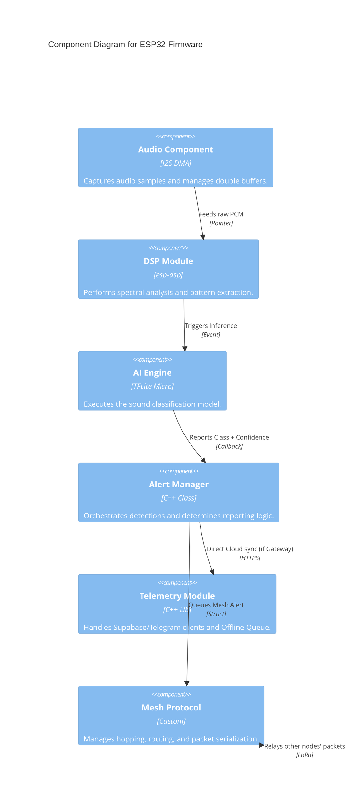
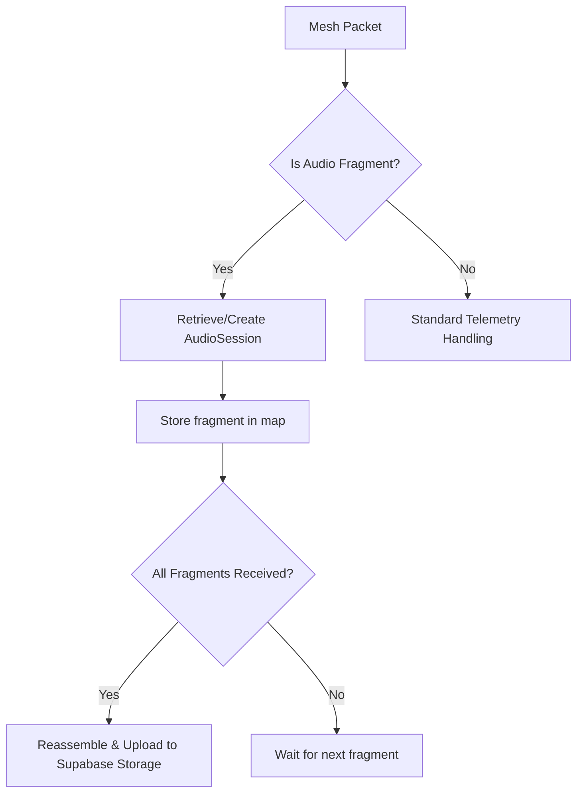

# Firmware Component Architecture

This document covers Level 3 (Component) of the system architecture, focusing on the ESP32-S3 Firmware.

## Level 3: ESP32-S3 Firmware Components

The firmware is organized into modular components that interact to achieve low-power chainsaw detection.

## Core Component: Alert Manager

The `AlertManager` is the central orchestrator of the firmware. It fulfills three critical roles:

1.  **Deduplication**: Ensures that transient or low-confidence detections do not flood the network.
2.  **Role-Based Routing**: 
    - **Node Role**: Packages detections into `MeshPacket` and sends to the nearest router.
    - **Gateway Role**: Unpacks `MeshPacket`, reassembles audio fragments, and syncs to Supabase/Telegram.
3.  **Persistence**: Manages the `OfflineQueue` for detections made during network outages.

### Data Reassembly Logic (Gateway)
When audio fragments arrive via the mesh, the AlertManager manages `AudioSession` states using a map of fragment indices.

