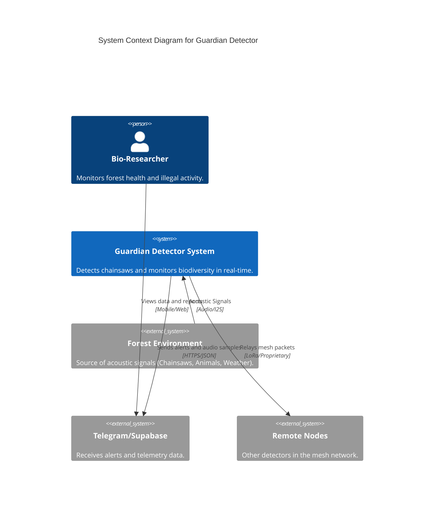
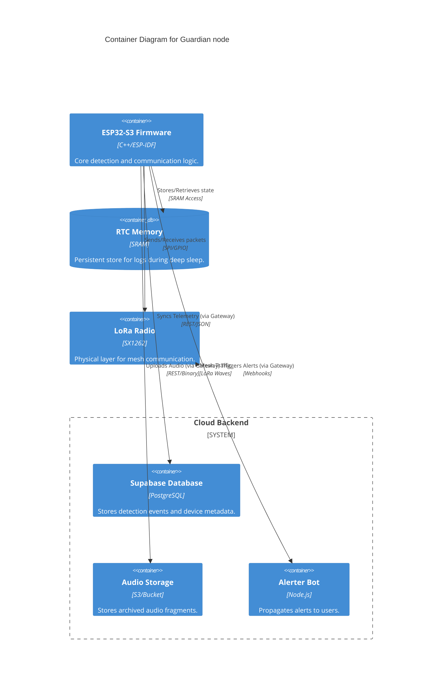

# High-Level System Architecture

This document covers Level 1 (Context) and Level 2 (Container) of the Guardian system architecture.

## Level 1: System Context

The Guardian system interacts with biological researchers (users), the physical environment (audio source), and various cloud alerting services.

## Level 2: Container

Within the Guardian system, we distinguish between the physical sensor node, the mesh network layer, and the cloud infrastructure.

