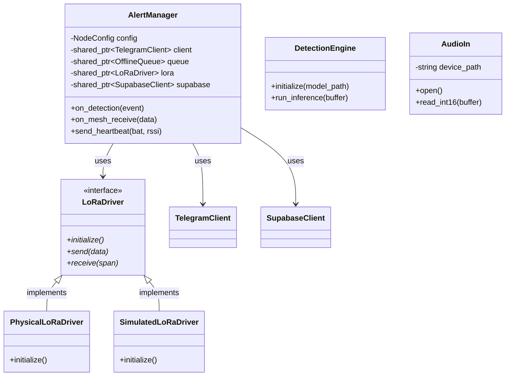
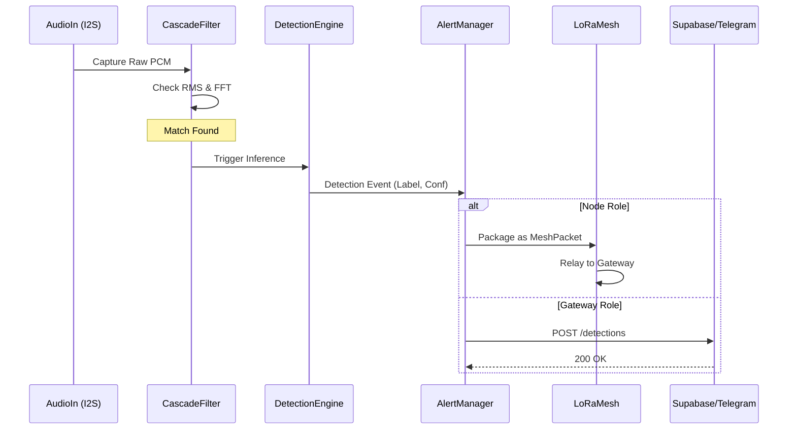
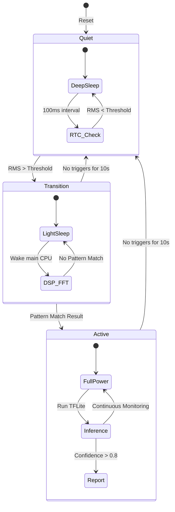

# Technical Architecture Details

This document provides low-level technical diagrams for the Guardian system implementation.

## 1. Class Diagram

Relationships between the core C++ classes in the `src/` directory.



## 2. Sequence Diagram: Positive Detection Flow

The flow of data from physical sensor capture to cloud notification.



## 3. State Machine: 3-Stage Power Cascade

Details the transitions between low-power states on the ESP32-S3.



## 4. Geospatial Localization Propagation

The system uses a recursive propagation model to geolocate nodes without individual GPS modules.

### Node Localization: Iterative Multi-lateration (IML)
1. **Gateway Anchor**: The gateway (physical anchor) broadcasts its precise (lat, lon) with 1m accuracy.
2. **Distance Estimation**: 1-hop nodes estimate distance from the anchor using the **Log-Distance Path Loss Model** based on RSSI.
3. **Recursive Calculation**: Once a node has 3+ neighbor anchors, it running a Least Squares solver (`localization_module.cpp`) to calculate its coordinates and then begins broadcasting as a "virtual anchor".

### Acoustic Event Localization: Weighted Centroid (WCL)
1. **Correlation**: The Supabase `ingest-mesh-data` function groups detections from multiple nodes within a 10s window.
2. **Triangulation**: The source coordinates $(x, y)$ are calculated as a weighted average of the reporting nodes' positions, weighted by detection confidence.

```mermaid
graph TD
    GW[Gateway / GPS Anchor] -->|Beacon| N1[Node 1: 1-Hop]
    GW -->|Beacon| N2[Node 2: 1-Hop]
    N1 -->|RSSI Estimate| N3[Node 3: 2-Hop]
    N2 -->|RSSI Estimate| N3
    N1 -->|Beacon| N3
    N3 -->|3 Anchors Reached| N3Pos[Calculate (x,y) via IML]
    
    Sound((Chainsaw)) -.-> N1
    Sound -.-> N3
    N1 -->|Detection (lat1, lon1)| Cloud[Supabase Cloud]
    N3 -->|Detection (lat3, lon3)| Cloud
    Cloud -->|WCL| Event[(Acoustic Event Map)]
```
