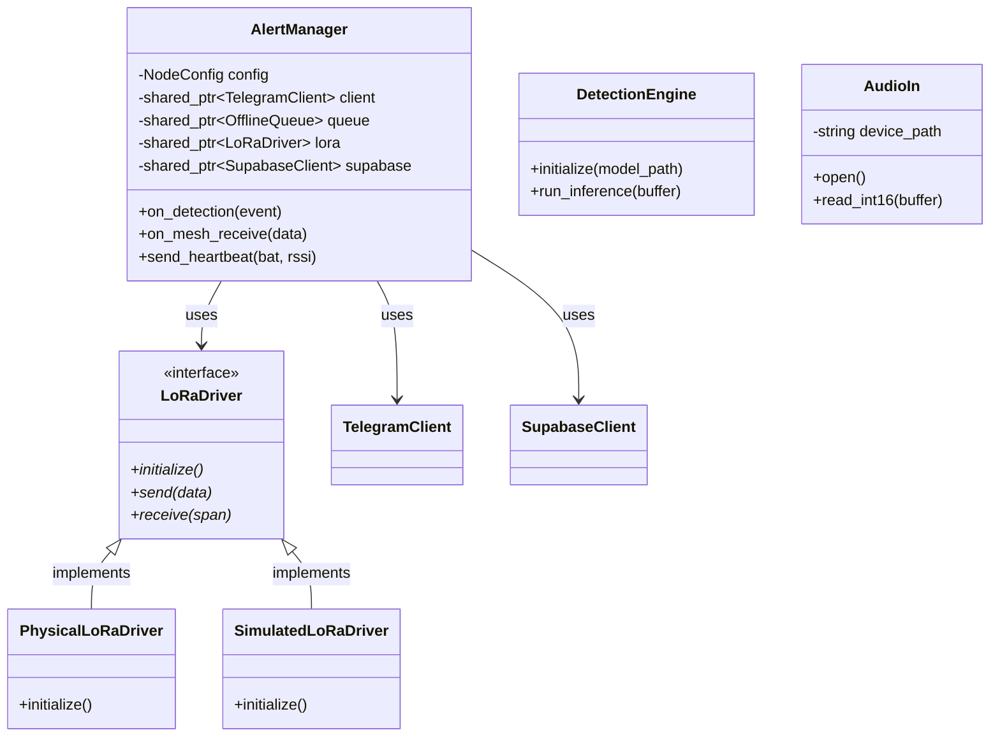
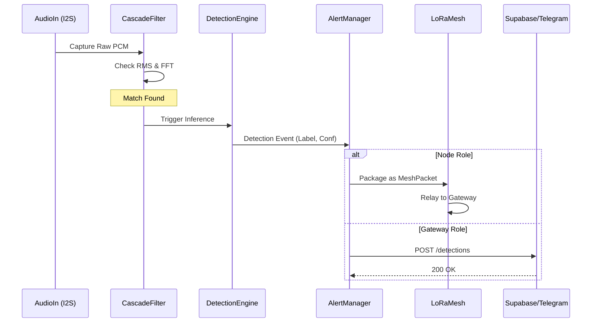
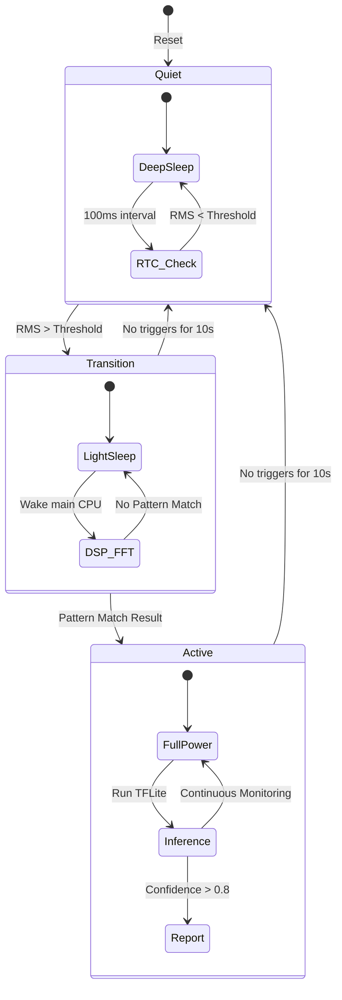

# Technical Architecture Details

This document provides low-level technical diagrams for the Guardian system implementation.

## 1. Class Diagram

Relationships between the core C++ classes in the `src/` directory.

## 2. Sequence Diagram: Positive Detection Flow

The flow of data from physical sensor capture to cloud notification.

## 3. State Machine: 3-Stage Power Cascade

Details the transitions between low-power states on the ESP32-S3.

