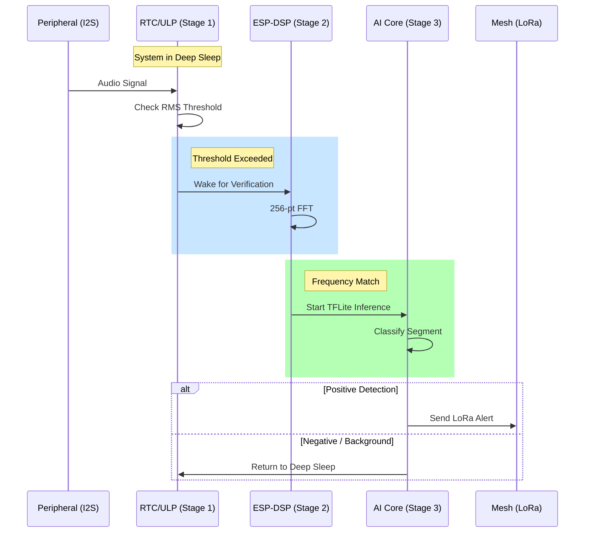
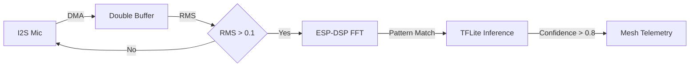

# ESP32-S3 Firmware Architecture

This document describes the internal architecture of the Guardian chainsaw detection firmware for the ESP32-S3 platform.

## 1. 3-Stage Power Cascade

To achieve extreme battery efficiency, the firmware operates in three distinct stages of activation.

### Stage 1: Quiet Monitoring (Deep Sleep)
In this stage, the main CPU is in deep sleep. Only the Ultra Low Power (ULP) co-processor or the RTC controller is active, monitoring the RMS levels from the digital microphone.

### Stage 2: Signal Verification (Transition)
If the RMS threshold is exceeded, the system enters Light Sleep or wakes a low-frequency DSP task. It uses the `esp-dsp` library to perform a spectral analysis (FFT) to check for characteristic frequency patterns of a chainsaw motor.

### Stage 3: AI Inference (Active)
If the spectral profile matches, the main CPU is fully clocked to 240MHz. The TFLite Micro engine runs the Edge Impulse model for final classification.

## 2. Component Layout

- `src/main/`: System orchestration and FreeRTOS tasks.
- `src/components/audio/`: I2S DMA management and double buffering.
- `src/components/dsp/`: Spectral Centroid and Bandwidth analysis.
- `src/components/ai/`: TFLite Micro wrapper and model integration.
- `src/components/telemetry/`: LoRa Mesh protocol implementation.

## 3. Data Flow

